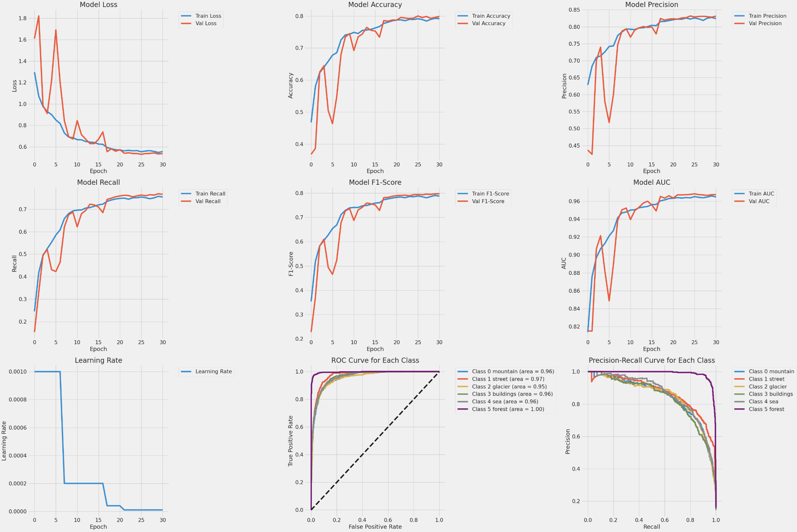
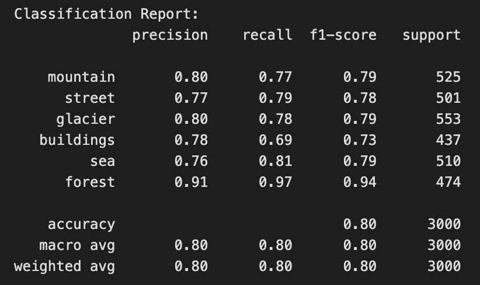
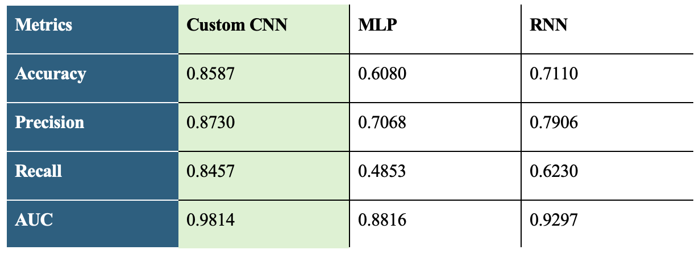

# Natural Scene Classification
Image classification in the overall field of computer vision plays an important role in categorizing into different scenes. Image classification is central to allowing systems to learn the contents of an image by identifying different classes for them to continuously interpret their environment, which is essential for practical applications like autonomous vehicles, environmental monitoring, disaster management, and geographic information systems (Akhtar et al., 2023). In contrast to object detection, in which the aim is to recognize specific objects, natural scene identification has to consider other factors, such as lighting, textures, and landscape types. This complexity demands sophisticated models to interpret various signal patterns under different environmental contexts (Sorkhi et al., 2020). Since the demand for an efficient automated system increases, the prediction of natural scenes plays a decisive role in enhancing the performance and reliability of technology that can interact with their surroundings.

Data source:
[Kaggle](https://www.kaggle.com/datasets/puneet6060/intel-image-classification/data)

## Convolutional Neural Network (CNN)
### Training result

### Classification report

### Testing

## Multi-Layer Perceptron (MLP)
### Training result

### Classification report

### Testing

## Recurrent Neural Network (RNN)
### Training result

### Classification report

### Testing

## Model Comparison

Generally, the assignment's image classification task is rather difficult sometimes, when performing on classifying images with similar environmental features. For instance, 'mountain' in winter conditions could be mistaken as 'glacier', and the 'glacier' images normally comes with water besides, which might be confused as 'sea'. Besides, 'street' and 'building' images propose ambiguity as well, considering they are both views in a city and there are possibly buildings around a street. Therefore, models without strong feature extracting capabilities such as basic MLP and RNN models struggle to make clear classification between the previously mentioned labels. Hence, most of the studies that deal with image classification integrate a convolutional block for MLP and RNN models for feature extraction, making them hybrid CNN-MLP or CNN-RNN models (Guo et al., 2018; Sharifzadeh et al., 2019; Shawky et al., 2020; Yin et al., 2019).
  
Overall, the **Custom CNN model** developed was undeniably the best-performing model within this assignment in the classifying natural scenes task. Its' balanced classification capability gave it more credibility as the best model with more reliability.
